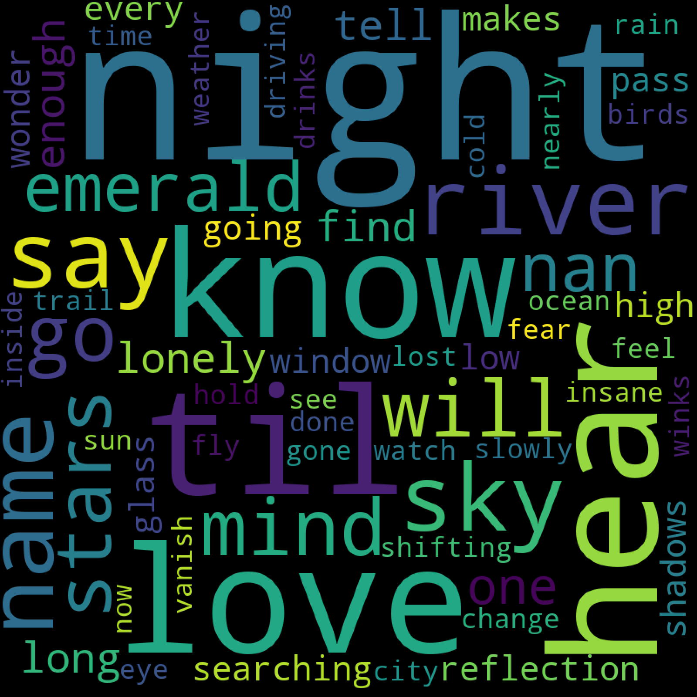

# Word Cloud example

This repo uses a sample CSV file I've thrown together to show an example word cloud. For this I've grabbed lyrics from a few songs and added to a file, it is basic but shows how to create a word cloud. Running the python file provided should generate an example such as the below

